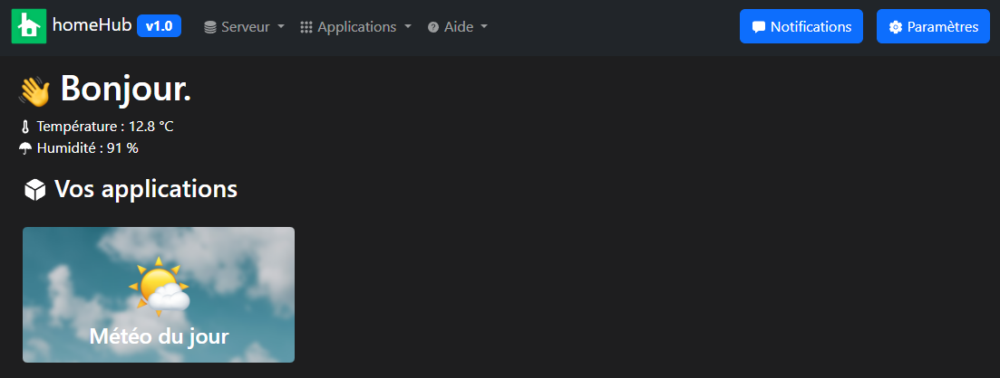

<h1 align="center"><br>homeHub App</h1>

Installez diverses applications sur votre espace homeHub, sur une seule machine, et rendez-les accessibles à tous les membres du réseau local.

> [!IMPORTANT]  
> **homeHub n'est pas fait pour être hebergé sur internet ! Nous vous recommandons fortement une utilisation dans un réseau privé !**

# Installation et démarrage

> [!NOTE]  
> L'installation peut varier d'un appareil à un autre.

## Systèmes d'exploitation

<details>
<summary><h2> Windows (stable)</h2></summary>

1) Installer les logiciels prérequis
    - [git for Windows](https://git-scm.com/download/win)
    - [Python](https://www.python.org/downloads/windows/) (Pensez à ajouter Python au PATH)
2) Télécharger homeHub
```bat
git clone https://github.com/Luckyluka17/homeHub.git
cd homeHub
```
3) Installer les paquets Python prérequis
```bat
pip install -r requirements.txt
```
4) Lancer le serveur
```bat
python -u homeHub.py
```

</details>
<details>
<summary><h2>Linux</h2></summary>

### Prérequis
```bash
sudo apt install python3 -y
sudo apt install python3-pip -y
sudo apt install git -y
```

### Commandes
```bat
git clone https://github.com/Luckyluka17/homeHub.git
cd homeHub
pip install -r requirements.txt
```

</details>
<!-- <details>
<summary><h2>Android (expérimental)</h2></summary>

1) Télécharger Termux

<a href="https://play.google.com/store/apps/details?id=com.termux&pcampaignid=web_share"></a>

Alternatives :

<a href="https://f-droid.org/fr/packages/com.termux/">Télécharger sur F-Droid</a> -
<a href="https://github.com/termux/termux-app/releases">Télécharger le fichier apk</a>


2) Ouvrez l'application, puis créez un nouveau terminal
3) Mettre à jour le système Linux
```sh
sudo apt update
sudo apt upgrade -y
```
4) Installer les paquets requis
```sh
sudo apt install python
sudo apt install python3-pip
sudo apt install git
```
5) Copier le dépôt
```sh
git clone https://github.com/Luckyluka17/homeHub.git
cd homeHub
```
6) Installer les bibliothèques Python requises
```sh
pip install -r requirements.txt
```
7) Démarrer le serveur
```sh
python3 -u homeHub.py
```

</details> -->

## Paramètres

| Nom | Description | Type de variable | Valeurs | 
| --- | --- | --- | --- |
| theme | Thème de l'application | str | "light", "dark" |
| disable_weather_on_home | Activer/désactiver la météo dans l'accueil | bool | true, false |

# Captures d'écran


# Applications disponibles

> [!NOTE]  
> [Cliquez ici pour afficher la liste des applications disponibles sur homeHub](https://github.com/homeHubOrg/homeHub/blob/main/APPS.md)

# Ressources utilisées
- [WinBox.js](https://nextapps-de.github.io/winbox/) 
- [Ionicons](https://ionic.io/ionicons)
- [Bootstrap 5.2](https://getbootstrap.com/docs/5.2/getting-started/introduction/)